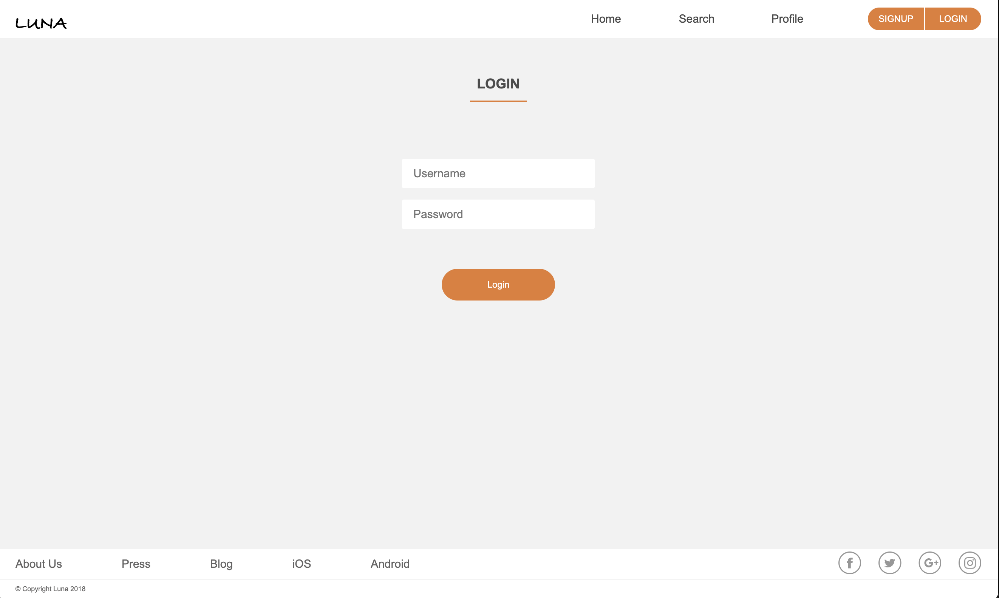

# 🌙 **Luna**

Luna is a sleek restaurant reviewing and rating app designed for food lovers. Whether you're on the hunt for the best-rated local spots or want to share your dining experience, Luna lets you do it all! Browse top-rated restaurants, explore reviews, and add your own feedback to create a foodie's paradise. 🍽️✨

## 🚀 **Features**

- 🌟 **Restaurant Ratings**: Discover top-rated restaurants with ease.
- 📝 **User Reviews**: Share your dining experiences or check out reviews from others.
- 📍 **Detailed Restaurant Pages**: View restaurant info like category, price level, address, and opening hours.
- 💬 **Interactive Reviews**: Comment on other reviews to start conversations.
- 🔍 **Explore Categories**: Filter restaurants by cuisine, price, or location.

## 🛠 **Tech Stack**

- **Frontend**: React, Redux
- **Backend**: Django, Django REST Framework
- **Database**: PostgreSQL
- **Infrastructure**: Docker, NGINX, Gunicorn, DigitalOcean

## 📸 **Screenshots**

- **Login Page**
  

- **Homepage**
  

- **Restaurant Page**
  

- **Search by Restaurant**
  

- **Search by Review**
  

- **Search by User**
  

- **Create Review Page**
  

## 📚 **How to Use**

- **Login Page**: Enter your credentials to access the app.
- **Homepage**: View top-rated restaurants and user reviews.
- **Restaurant Page**: Click on a restaurant to view its details and reviews.
- **Search**: Find restaurants or reviews by keywords, or search by users.
- **Add Review**: If you're logged in, you can add your own reviews.
- **Comment on Reviews**: Join conversations by commenting on existing reviews.

